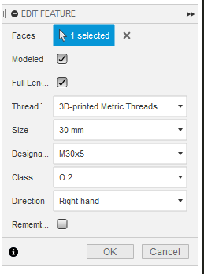

# Fusion 360 Thread Profiles for 3D-Printed Threads

Fusion 360 comes with various thread standards, most of which are not a great fit for 3D printing because they are too fine to work well when printed.
This project defines thread profiles that are aimed at 3D printing so that they work, even when printed with lower detail settings (e.g. 0.30mm layer height).

## What's in the Box?

The provided `3DPrintedMetric.xml` file contains the thread profiles listed below.
Additional profiles can be easily generated from the included Python script.

**Shape:** 60° trapezoidal  
**Size (OD):** 8-50mm  
**Pitch:** 3.5mm, 5mm  
**Classes:** O.0, O.1, O.2, O.4, O.8

The classes specify tolerances.
O.0 has the tightest tolerances which are loosely based on ISO M30x3.5 6g/6H. 
The number after the 'O.' specifies, in tenths of a millimeter, how much the major, minor and pitch diameters are offset compared to O.0.
For example, O.2 would have a 0.2mm looser tolerance than O.0.

## Install and Use

If you just want to use the profiles with no customization, download the file `3DPrintedMetric.xml`, save it in the following directory and then restart Fusion 360.

**On Windows:**
```
%localappdata%\Autodesk\webdeploy\Production\<version ID>\Fusion\Server\Fusion\Configuration\ThreadData
```

**On Mac OS:**

*Macintosh HD> Users> [Username] > Library > Application Support > Autodesk > Webdeploy > production > [Version specific ID] > Then right click on "Autodesk Fusion 360" and choose Show Package Contents > Contents > Libraries > Applications > Fusion > Fusion > Server > Fusion > Configuration >ThreadData*

(see also [here](https://knowledge.autodesk.com/support/fusion-360/learn-explore/caas/sfdcarticles/sfdcarticles/Custom-Threads-in-Fusion-360.html))

When you now create or edit a *Thread* feature, you should be able to select the Thread Type *"3D-printed Metric Threads"*.



> Note: Profiles will need to be reinstalled after every Fusion 360 update. To do this automatically, check out the [ThreadKeeper](https://github.com/thomasa88/ThreadKeeper) plugin.

## Generating Customized Profiles

You can generate your own thread profile file using the `main.py` script.
To execute the script, **Python 3.9** or newer is required.
The script has no parameters and can be executed like so:

```bash
python main.py
```

This will create a file named `output.xml` in the working directory which you can then rename and install in Fusion as described above.

To customize the generated profiles, simply edit the values defined at the top of `main.py`.

```python
NAME = "3D-printed Metric Threads"
UNIT = "mm"
ANGLE = 60.0
SIZES = list(range(8, 51))
PITCHES = [3.5, 5.0]
OFFSETS = [.0, .1, .2, .4, .8]
```
